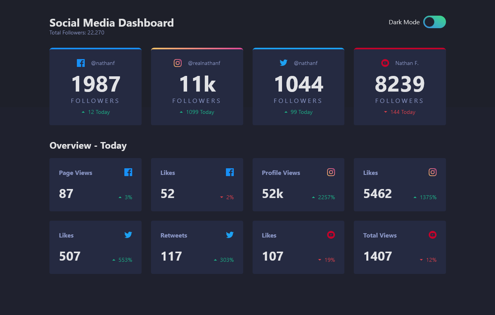

# Frontend Mentor - Social media dashboard with theme switcher solution

## Table of contents

- [Frontend Mentor - Social media dashboard with theme switcher solution](#frontend-mentor---social-media-dashboard-with-theme-switcher-solution)
  - [Table of contents](#table-of-contents)
  - [Overview](#overview)
    - [The challenge](#the-challenge)
    - [Screenshot](#screenshot)
    - [Links](#links)
  - [My process](#my-process)
    - [Built with](#built-with)
  - [Author](#author)

## Overview

### The challenge

Users should be able to:

- View the optimal layout for the site depending on their device's screen size
- See hover states for all interactive elements on the page
- Toggle color theme to their preference

### Screenshot

### Links

- Solution URL: [Github](https://github.com/nicklatch/frontEndMentor/tree/main/social-media-dash)
- Live Site URL: [Vercel](https://front-end-mentor-social-media-dash-nicklatch.vercel.app/)

## My process

### Built with

- Semantic HTML5 markup
- CSS custom properties
- Flexbox
- CSS Grid
- [React](https://reactjs.org/) - JS library
- Axios

## Author

- GitHub - [@nicklatch](https://github.com/nicklatch)
- Frontend Mentor - [@nicklatch](https://www.frontendmentor.io/profile/nicklatch)
- Mastodon - [@nicklatcham](https://mstdn.plus/@nicklatcham)
