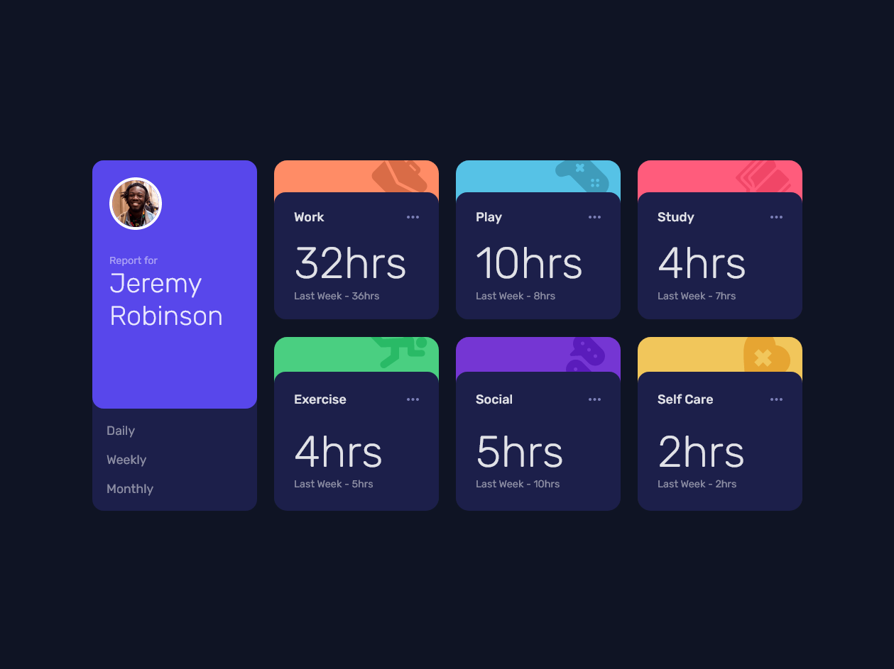

# Frontend Mentor - Time tracking dashboard solution

## Table of contents

- [Frontend Mentor - Time tracking dashboard solution](#frontend-mentor---time-tracking-dashboard-solution)
  - [Table of contents](#table-of-contents)
    - [The challenge](#the-challenge)
    - [Screenshot](#screenshot)
    - [Links](#links)
    - [Built with](#built-with)
    - [Continued development](#continued-development)
    - [Useful resources](#useful-resources)
  - [Author](#author)

**Note: Delete this note and update the table of contents based on what sections you keep.**

### The challenge

Users should be able to:

- View the optimal layout for the site depending on their device's screen size
- See hover states for all interactive elements on the page
- Switch between viewing Daily, Weekly, and Monthly stats

### Screenshot

### Links

- Solution URL: [GitHub](https://github.com/nicklatch/frontEndMentor/tree/main/time-tracking-dash)
- Live Site URL: [Vercel](https://your-live-site-url.com)
### Built with

- Semantic HTML5 markup
- CSS
  - Custom Props
  - Flexbox
  - CSS Grid
- [React](https://reactjs.org/) - JS library
- [Vite](https://vitejs.dev) - Vite Build Tool

### Continued development

I want and need to focus more on how to make my components for project agnostic/polymorphic. I would also like to continue honing in my vanilla css skills. Tailwind is great, but i've fallen behind on alot of the new and exciting stuff!

### Useful resources

- [MDN](https://developer.mozilla.org/en-US/) - MDN is always one of my go-to's for explanations
- [DevDocs](https://devdocs.io/) - I always have this open for a quick reference!

**Note: Delete this note and replace the list above with resources that helped you during the challenge. These could come in handy for anyone viewing your solution or for yourself when you look back on this project in the future.**

## Author

- GitHub - [@nicklatch](https://github.com/nicklatch)
- Frontend Mentor - [@nicklatch](https://www.frontendmentor.io/profile/nicklatch)
- Mastodon - [@nicklatcham](https://mstdn.plus/@nicklatcham)